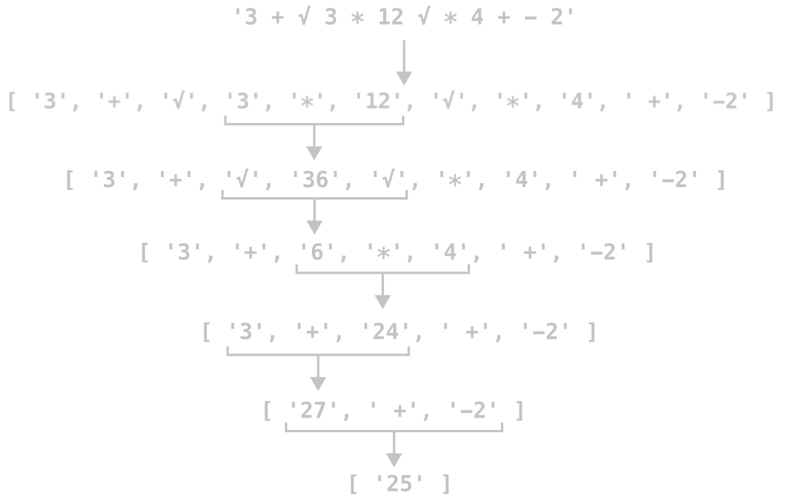

# README CALCULATOR APP
With this little project i tried to make a calculator app by copying the design of the CASIO HL-815L, using react with redux. I know it is kinda overkill to use react with such a small application, but i did it for practise reasons. Here is some basic information about it:

## Functionality
Toggle the power by pressing the 'OFF' button. The initial state is on. You can type in a mathematical expression containing more operators, and the calculator will understand basic maths logic and eg. calculate terms inside of a square root first. You close the term inside of the square root with another square root symbol. 

Like the original casio i implemented some memory functionality. Pressing the 'M+' button will add your result to the value in the memory (which is by default zero), 'M-' will substract it. Pressing the 'MRC' button displays the value stored in the memory and sets it to zero at the same time.

When you got a result displayed you may continue calculating with this result by typing a mathematical operator followed by some mathematical terms. Starting with a number will start a new expression.

The 'C' button deletes the lates symbol displayed. 'CA' sets the displayed term to an empty string.

## Differences from the original Casio
Unlike the original casio calculator this app is not turned on by pressing the 'AC' button, because i found it more elegant to toggle the power status with a single button. 

Further the original casio did not allow you to write more complex mathematical expressions and always returned the result when pressing an operator after for example `2+2`.

Obviously the font i used for the display is not the same as the original casios font but i think it comes pretty close. It is just a bit wider and does not contain symbols for the most operators but i am kinda to lazy to search for the holy grail perfect casio font. Everyone who tried to find a certain font on the internet can understand me, i hope.

Although the functionality of ending a square root term with another square root allows you to write more complex expressions, it does not allow you to nest them inside each other. In case you do not close the square root term, the calculator will expect every symbol after your square root symbol to be inside of it.

## Logic
The logic behind this calculator is pretty simple. A parse function returnes an array out of the string term which the user creates. This array has seperate entries for numbers and operators. In the next step the calculating operations are carried out in the following order sqrt -> percent -> multiply/divide -> add/substract. This four operations are separated in one recursive function each, which simplify the expression by calculating one term at a time. The recursion gets to an end when the specific operator cannot be found anymore.

The following scheme shows how it would work for a given example:

Feel free to contact me if you got any questions or bugs you want to report o1
